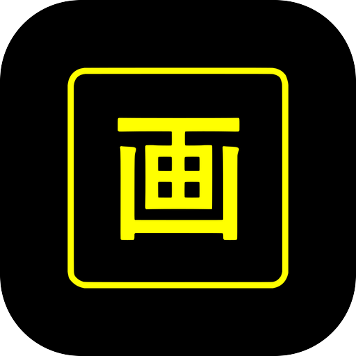

<div align="center">



# 白い熊 画

**Japanese OCR popup dictionary — point a capture box at any app, or the camera at a page, and read the Japanese under it.**

A fork of [Kaku](https://github.com/0xbad1d3a5/Kaku), picked up where upstream stopped in 2022, with
**major additions**: on-device **MangaOCR**, **Yomitan dictionaries** rendered as Yomitan renders
them, **camera OCR**, a full black-yellow settings page, backup and restore — and no network at all.

Installs **side-by-side** with Kaku (app id `shiroikuma.kaku`).

**📥 Latest release: [`0.1.0+025`](https://github.com/ShiroiKuma0/shiroikuma-kaku/releases/latest)** — [all releases & APK downloads »](https://github.com/ShiroiKuma0/shiroikuma-kaku/releases)

</div>

---

## 🔍 MangaOCR on the phone
The model the desktop manga readers use, running on the device (ONNX Runtime, int8): vertical text,
stylised fonts and speech bubbles that Tesseract stumbles over read cleanly. Every character comes
with its alternative candidates — swipe down on one to pick another. Tesseract 5 stays as the
fallback.

---

## 📖 Yomitan dictionaries, the way Yomitan shows them
Import JMdict, Jitendex, KANJIDIC, frequency and pitch dictionaries straight from their Yomitan
zips. Words are deinflected by a port of **Yomitan's own deinflector** and shown in each
dictionary's own layout — sense groups, example sentences with furigana, notes, pictures, rare-kanji
glyphs — recoloured to the theme, with frequency chips and a pitch-accent graph. "See also" links
look the word up in place, and pinch zooms the text.

---

## 📷 白い熊 画 カメラ
A camera view under the capture box for paper books and signs: freeze the picture, tap to focus,
pinch to zoom, light — or switch on Live and it reads by itself as soon as the picture holds still.
Its own launcher icon, an app shortcut and a notification button get you there in one tap.

---

## ⚡ Instant mode that works
Let go of the capture box and the words under it are already in a compact popup beside it — at any
box size (upstream only fired for boxes narrower than one column of large text).

---

## 🎨 白い熊 画 UI
Black and yellow everywhere by default, and every colour, font, size, border and corner adjustable
on one settings page with live previews — the result window, the popup, the recognised characters,
the kanji choice, the capture box, dialogs and toasts.

---

## 💾 Export / Import, no network
One ZIP carries the settings, fonts, OCR models and dictionaries, so a new phone is ready in one
import; the family's backup automation drives it unattended. The app has no internet permission:
models and dictionaries are imported from files, their download URLs a Copy URL away.

---

## Built on Kaku
A fork of [Kaku](https://github.com/0xbad1d3a5/Kaku) by 0xbad1d3a5 (app id `shiroikuma.kaku`, so it
coexists with the original) — for years the best on-screen Japanese OCR dictionary for Android.
Kaku's code is under the BSD 3-Clause licence ([`LICENSE-Kaku-BSD-3`](LICENSE-Kaku-BSD-3)); this
fork, which ports Yomitan's GPL code, is distributed under the GNU GPL v3 ([`LICENSE`](LICENSE)).

## Building
```bash
git clone https://github.com/ShiroiKuma0/shiroikuma-kaku.git && cd shiroikuma-kaku
git checkout custom
# keystore.properties (storeFile / storePassword / keyAlias / keyPassword) is required for release builds
./gradlew buildFork
```

After installing, open 白い熊 画 UI (the cog on the start screen) → **OCR** and **Dictionaries**:
each row shows where to download the file, then import it with a tap.
